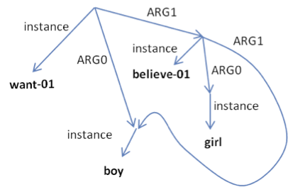

Abstract Meaning Representation (AMR) 1.0 Specification
=======================================================

**October 31, 2012**

_Laura Banarescu, Claire Bonial, Shu Cai, Madalina Georgescu, Kira Griffitt, 
Ulf Hermjakob, Kevin Knight, Philipp Koehn, Martha Palmer, Nathan Schneider_


Part I. Introduction
====================

AMR captures “who is doing what to who” in a sentence.  Each sentence is
represented as a **rooted, directed, acyclic graph** with labels on edges
(relations) and leaves (concepts).

Like a parse tree, AMR provides a single, traversable structure that takes all
words into account.  It is not a disconnected set of annotation layers.  Unlike
a parse tree, the AMR is abstract.  It may represent any number of natural
language sentences.  AMR does not annotate the individual words in a sentence,
like a dependency parse does.

AMR implements a simplified, standard neo-Davidsonian semantics [Davidson 1967,
Higginbotham 1985], using standard feature structure representation [Shieber
1986, Carpenter 1992].  AMR’s formal origins are in unification systems [Kay
1979, Knight 1989, Moore 1989] and natural language generation [Mann 1982,
Elhadad 1988, Knight & Hatzivassiloglou 1995].  Predicates senses and core
semantic roles in AMR are drawn from the **amazing OntoNotes project**.

AMR does not say anything about how it wants to be processed.  It is closer to
English than to other languages.  It is not an interlingua.


Example
-------



This AMR means (roughly):  There is a wanting event, whose ARG0 (wanter) is a
boy, and whose ARG1 (wanted thing) is a believing event.  This believing event
has an ARG0 (believer), which is a girl, and it has an ARG1 (believed thing),
which is the **same boy** just mentioned.  Here, `boy` plays two roles: (1) it is
the ARG0 of `want-01`, and (2) it is the ARG1 of `believe-01`.  The AMR captures
this with two directed edges pointing to the same node.  (Per OntoNotes,
predicate senses are marked with suffixes like `-01` and `-02`, while ARG0,
ARG1, etc., denote core, predicate-specific roles.)


Here is a text-friendly way to write the same AMR:

```lisp
(w / want-01
   :ARG0 (b / boy)
   :ARG1 (b2 / believe-01
             :ARG0 (g / girl)
             :ARG1 b))
```

The variables `w`, `b`, `b2`, and `g` correspond to internal nodes in the graph above. 
Note that b appears twice in this format, the first time as `(b / boy)` and the
second time simply as `b`.

This AMR can also be viewed as conjunction of logical triples, omitting root
information:

```
instance(w, want-01) ^      /* w is an instance of wanting */
instance(b, boy) ^          /* b is an instance of boy */
instance(b2, believe-01) ^	/* b2 is an instance of believing */
instance(g, girl) ^		    /* g is an instance of girl */
ARG0(w, b) ^			    /* b is the wanter in w */
ARG1(w, b2) ^			    /* b2 is the wantee in w */
ARG0(b2, g) ^			    /* g is the believer in b2 */
ARG1(b2, b)			        /* b is the believee in b2 */
```


Abstraction away from English
-----------------------------

The AMR above can be expressed variously in English:

> The boy wants the girl to believe him.
> 
> The boy wants to be believed by the girl.
> 
> The boy has a desire to be believed by the girl.
> 
> The boy’s desire is for the girl to believe him.
> 
> The boy is desirous of the girl believing him.

etc.

The concept `want-01` might be realized as a verb (“wants”), a noun (“desire”),
or an adjective (“desirous”).  

We think of AMR leaf-labels as concepts rather than words.  We do not point to
an element in an AMR and say “that is a noun” or “that is a verb”.  Rather, we
say “that is an object” or “that is an event”.

A single entity (“boy”) can play multiple roles simultaneously (e.g., “ARG0” of
`want-01`, and “ARG1” of `believe-01`).  The AMR does not talk about pronouns or
zero-pronouns, though these are natural mechanisms for expressing multiple roles
in English.

In many cases, English function words do not show up at all in AMR:

```lisp
(a / adjust-01
   :ARG0 (b / girl)
   :ARG1 (m / machine))
```

> The girl **made** adjustments **to** the machine.
>
> The girl adjusted the machine.
>
> The machine **was** adjusted **by** the girl.

```lisp
(k / kill-01
   :time (y / yesterday))
```

> The killing **happened** yesterday.
>
> The killing **took place** yesterday.

```lisp
(a / and
   :op1 (b / boy)
   :op2 (g / girl))
```

> the boy and the girl
>
> **both** the boy and the girl

```lisp
(b / boat
   :poss (h / he))
```

> his boat
>
> his **own** boat


More Logical than Syntax
------------------------

AMR strives for a more logical, less syntactic representation.  For example,
“the boy must not go” and “the boy may not go” are syntactically similar, but
the placement of negation (`:polarity -`) is very different in the two AMRs:

```lisp
(o / obligate-01
   :ARG2 (g / go-01
            :ARG0 (b / boy)
            :polarity -))
```

> The boy must not go.
>
> It is obligatory that the boy not go.

```lisp
(p / permit-01
   :ARG1 (g / go-01
            :ARG0 (b / boy))
   :polarity -)
```

> The boy may not go.
>
> The boy is not permitted to go.
>
> It is not permissible for the boy to go.
>
> The boy does not have permission to go.

The AMR transparently represents what is being negated.  Note that the concept
`permit-01` can be realized as a modal, a participle, or a noun.  


Focus
-----

The root of an AMR binds its contents into a single, traversable directed
graph.  It also serves as a rudimentary representation of overall focus.  So we
have:

```lisp
(w / white
   :domain (m / marble))
```

> The marble is white.
>
> the whiteness of the marble

```lisp
(m / marble
   :mod (w / white))
```

> the white marble
>
> the marble that is white

```lisp
(s / see-01
   :ARG0 (b / boy)
   :ARG1 (w / white
            :domain (m / marble)))
```

> The boy sees that the marble is white.
>
> The boy sees the whiteness of the marble.

```lisp
(s / see-01
   :ARG0 (b / boy)
   :ARG1 (m / marble
            :mod (w / white))
```

> The boy sees the white marble.
>
> The boy sees the marble that is white.

We can write `:domain-of` as an inverse of `:domain`, but we often shorten this to
`:mod`.

Inverse roles are useful for maintaining a single rooted structure, e.g.:

```lisp
(s / see-01
   :ARG0 (b / boy)
   :ARG1 (g / girl
            :ARG0-of (w / want-01
                        :ARG1 b)))
```

> The boy saw the girl who wanted him.
>
> The boy saw the girl who he was wanted by.
>
> The girl who wanted the boy was seen by him.

In this AMR, the role `:ARG0-of` connects `girl` with `want-01` in a natural way.
 
To re-focus an AMR, we can “lift up” any node to the root, and then imagine all
other nodes falling down.  For example, if we lift up the `w` node above, we get
the same content, but rearranged:


```lisp
(w / want-01
   :ARG0 (g / girl
            :ARG1-of (s / see-01
                        :ARG0 (b / boy)))
   :ARG1 b)
```

> The girl who was seen by the boy wants him.
>
> The boy is wanted by the girl he saw.

This is a matter of focusing: the first AMR (rooted by `see-01`) is about the
seeing, while the second AMR (rooted by `want-01`) is about the wanting.


Another example of an inverse role (`:instrument-of`):


```lisp
(c / change-01
   :ARG1 (d / document
            :instrument-of (r / regulate-01)))
```

> The regulatory documents were changed.


AMR slogans
-----------

Here are some slogans that make it easier to work with AMR:

  - AMR captures the rough meaning of a sentence in a single, traversable directed acyclic graph.
  - AMR does not say anything about how it wants to be processed.  
  - AMR is not an interlingua.
  - There are no nouns and verbs in AMR.
  - When we write AMR by hand, constituent trees and dependency trees are generally not needed.
  - We cannot read off a unique English sentence from an AMR.

An AMR is like a foreign-language translation.  Someone who creates an AMR from
English may not provide links between AMR concepts and English word tokens.  But
it is reasonable to think about doing such an alignment later (perhaps
automatically), just as it is reasonable to align tokens in bilingual texts.


Limitations of AMR 1.0
----------------------

AMR 1.0 is over-simple in many ways:

  - It is geared toward English and the vocabulary of English.  
  - It does not represent quantifier scope, or even universal quantification at all.
  - It does not represent co-references that cross sentence boundaries.
  - It drops grammatical number, tense, aspect, quotation marks, etc.
  - It does not deeply capture many noun-noun or noun-adjective relations.
  - It does not include deep frames such as Earthquake (with roles for magnitude, epicenter, casualties, etc) or Pregnancy (with roles for mother, father, baby gender, time since inception, etc).  AMR 1.0 looks forward to AMR 2.0!


Part II.  Concepts and relations
================================

Concepts are tokens that appear at the leaves of AMR graphs.  AMR does not
formally carve the world up into events, objects, features, etc., though we may
refer to a certain concept instance as an event.  The following AMR has three
concepts (boy, want, believe):


```lisp
(w / want-01
   :ARG0 (b / boy)
   :ARG1 (b2 / believe-01
             :ARG0 b))
```

> The boy wants to believe.

The slash (`/`) is shorthand for the `:instance` relation.  This relation shows up
more clearly in AMR graph format (see Introduction).

Concepts in AMR 1.0 are usually written with English words or phrases.  Concepts
with core semantic relations may have sense tags, to identify the semantic
frame:

```lisp
(b / believe-01
   :ARG0 (b / boy))
```

> The boy believes.

AMR semantic relations are best described through examples; see the next section
([Phenomena](#part-iii--phenomena)).  Here, we only provide a brief summary listing.

Core `:ARGx` roles.  AMR 1.0 uses numbered `:ARGx` from OntoNotes:

```lisp
:ARG0, :ARG1, :ARG2, :ARG3, :ARG4, :ARG5
```

Non-core roles:

```lisp
:accompanier, :age
:beneficiary
:cause, :compared-to, :concession, :condition, :consist-of
:degree, :destination, :direction, :domain, :duration
:example
:instrument
:location
:manner, :mod, :mode
:name
:part, :polarity, :poss, :purpose
:quant
:scale, :source, :subevent, :subset
:time, :topic, :unit
:value
```

Roles used in date-entity:

```lisp
:calendar, :century, :day, :dayperiod, :decade, :era, :month, :quarter, :season, :timezone, :weekday, :year, :year2
```

Roles of the form `:opx` are used in conjunctions, and in certain types of
locations and times:

```lisp
:op1, :op2, :op3, :op4, …
```

Roles of the form `:prep-X` are used in cases where there is no good relation from
the list above.  AMR likes to avoid these.  Here is a partial list.  It is only
partial, as other `:prep-X` relations are legal AMR.

```lisp
:prep-against, :prep-along-with, :prep-amid, :prep-among, :prep-as, :prep-at
:prep-by
:prep-concerning, :prep-considering
:prep-despite
:prep-except, :prep-excluding
:prep-following, :prep-for, :prep-from
:prep-in, :prep-in-addition-to, :prep-in-spite-of, :prep-into
:prep-like
:prep-on, :prep-on-behalf-of, :prep-opposite
:prep-per
:prep-regarding
:prep-save, :prep-such-as
:prep-through, :prep-to, :prep-toward
:prep-under, :prep-unlike
:prep-versus
:prep-with, :prep-within, :prep-without
```
etc.

Some conjunctions are also not well-covered under the list of non-core roles. 
AMR also likes to avoid these, but sometimes we have no good alternative:


```lisp
:conj-as-if
```
etc.

All relations above have inverses of the form `:X-of`.


```lisp
:ARG0-of, :ARG1-of
:cause-of
```
etc.


Part III.  Phenomena
====================

Core roles
----------

Core roles are taken from the OntoNotes semantic role layer.  OntoNotes
predicates are sense-labeled words (e.g., `sentence-01`).  They are
predicate-specific and numbered.  For example: 

  - `:ARG0` of `charge-01` is the person doing the charging.
  - `:ARG1` of `charge-01` is the person being charged.
  - `:ARG2` of `charge-01` is the role or crime (for which `:ARG0` is charging `:ARG1`).
<p></p>
  - `:ARG0` of `sentence-01` is the person doing the sentencing.
  - `:ARG1` of `sentence-01` is the person being sentenced.
  - `:ARG2` of `sentence-01` is the role or crime.
<p></p>
  - `:ARG0` of `fine-01` is the person doing the fining.
  - `:ARG1` of `fine-01` is the amount of the fine (e.g., $1000).
  - `:ARG2` of `fine-01` is the person being fined.
  - `:ARG3` of `fine-01` is the role or crime.

Note the predicate-sensitivity: a person might naturally be the `:ARG1` of
`sentence-01`, but simultaneously the `:ARG2` of `fine-01`.

One semantic frame may be realized in vastly different ways in English:

```lisp
(d / describe-01
   :ARG0 (h / he)
   :ARG1 (m / mission)
   :ARG2 (f / failure))
```

> He described the mission as a failure.
>
> As he described it, the mission was a failure.
>
> His description of the mission: failure.

Here, the AMR does not worry about representing the words “as”, “it”, or “was”.

Note that OntoNotes documentation for predicates and roles is often loose or
humorous.  For example, the `:ARG0` and `:ARG1` of `research-01` are nicknamed
“student” and “subject”, but this does not mean that `research-01` is restricted
to situations where the `:ARG0` is literally a student.

If OntoNotes is missing a predicate, AMR accepts `-00`:


```lisp
(c / comeback-00
   :ARG0 (b / band))
```

> the band experienced a comeback


Modality
--------

AMR represents syntactic modals with concepts like `possible`, `likely`,
`obligate-01`, `permit-01`, `recommend-01`, `prefer-01`, etc.:

```lisp
(p / possible
   :domain (g / go-01
              :ARG0 (b / boy)))
```

> The boy can go.
>
> It is possible that the boy goes.

```lisp
(o / obligate-01
   :ARG2 (g / go-01
            :ARG0 (b / boy)))
```

> The boy must go.
>
> The boy is obligated to go.
>
> It is obligatory that the boy go.

```lisp
(o / permit-01
   :ARG1 (g / go-01
            :ARG0 (b / boy)))
```

> The boy may go.
>
> The boy is permitted to go.
>
> It is permissible that the boy go.

```lisp
(p / possible
   :domain (r / rain-01))
```

> It may rain.
>
> It might rain.
>
> Rain is possible.
>
> It’s possible that it will rain.

```lisp
(r / recommend-01
   :ARG1 (g / go-01
            :ARG0 (b / boy)))
```

> The boy should go.
>
> It is recommended that the boy go.


```lisp
(l / likely
   :domain (g / go-01
              :ARG0 (b / boy)))
```

> The boy is likely to go.
>
> It is likely that the boy will go.

AMR ignores the modal “would”, except in cases like:


```lisp
(p / prefer-01
   :ARG0 (b / boy)
   :ARG1 (g / go-01
            :ARG0 b))
```

> The boy would rather go.
>
> The boy prefers to go.

Another example:


```lisp
(u / use-03
   :ARG0 (i / i)
   :ARG1 (w / work-01
            :ARG0 i))
```

> I am used to working.


Negation
--------

AMR represents negation logically, using `:polarity`.


```lisp
(g / go-01
   :ARG0 (b / boy)
   :polarity -)
```

> The boy doesn’t go.

```lisp
(p / possible
   :domain  (g / go-01
               :ARG0 (b / boy))
   :polarity -)
```

> The boy can’t go.
>
> It’s not possible for the boy to go.

```lisp
 (p / possible
    :domain (g / go-01
               :ARG0 (b / boy)
               :polarity -))
```

> It is possible for the boy not to go.
>
> It is possible for the boy to not go.

```lisp
(p / obligate-01
   :ARG2 (g / go-01
            :ARG0 (b / boy))
   :polarity -)
```

> The boy doesn’t have to go.
>
> It’s not necessary for the boy to go.

```lisp
(p / obligate-01
   :ARG2 (g / go-01
            :ARG0 (b / boy)
            :polarity -))
```

> The boy must not go.
>
> It’s obligatory that the boy not go.

```lisp
(t / think-01
   :ARG0 (b / boy)
   :ARG1 (w / win-01
            :ARG0 (t2 / team
                      :poss b)
            :polarity -)
```

> The boy thinks his team won’t win.  
>
> The boy doesn’t think his team will win.  (colloquially, ambiguously)

```lisp
(t / think-01
   :ARG0 (b / boy)
   :ARG1 (w / win-01
            :ARG0 (t2 / team
                      :poss b))
   :polarity -)
```

> It’s not true that the boy thinks his team will win.  
>
> The boy doesn’t think his team will win.  (colloquially, ambiguously)

```lisp
(h / have-01 
   :polarity -
   :ARG0 (i / i)
   :ARG1 (m / money))
```

> I don’t have any money.
>
> I have no money.

```lisp
(e / eat-01
   :polarity -
   :ARG0 (p / person
            :mod (e / every)))
```

> No one ate.
>
> Every person failed to eat.

Negative English affixes are also represented with the `:polarity` role:


```lisp
(a / appropriate
   :ARG1 (c / comment)
   :polarity -)
```

> the comment is inappropriate
>
> the comment is not appropriate

```lisp
(c / comment
   :mod (a / appropriate
          :polarity -))
```

> the inappropriate comment
>
> the comment that is appropriate
>
> the comment that is not appropriate


Wh-Questions
------------

To capture wh-questions, AMR uses the concept `amr-unknown` (in-place!) to
indicate wh-questions:


```lisp
(f / find-01
   :ARG0 (g / girl)
   :ARG1 (a / amr-unknown))
```

> What did the girl find?

```lisp
(f / find-01
   :ARG0 (g / girl)
   :ARG1 (b / boy)
   :location (a / amr-unknown))
```

> Where did the girl find the boy?

```lisp
(f / find-01
   :ARG0 (g / girl)
   :ARG1 (b / boy)
   :manner (a / amr-unknown))
```

> How did the girl find the boy?

```lisp
(f / find-01
   :ARG0 (g / girl)
   :ARG1 (t / toy
            :poss (a / amr-unknown)))
```

> Whose toy did the girl find?

```lisp
(r / run-01
   :ARG0 (g / girl)
   :mod (f / fast
          :degree (a / amr-unknown)))
```

> How fast did the girl run?

```lisp
(g / see-01
   :ARG0 (g / girl)
   :ARG1 (a / amr-unknown
            :mod (p / purple)))
```

> What purple thing did the girl see?

```lisp
(l / lead-01
   :ARG0 (s / she)
   :ARG1 (a / amr-unknown
            :domain (i / investigate-01)))
```

> Which investigation did she lead?

Note that wh- words in relative clauses are treated differently, using inverse
roles instead of `amr-unknown`:


```lisp
(k / know-01
   :ARG0 (i / i)
   :ARG1 (p / person
            :ARG1-of (s / see-01
                        :ARG0 (y / you))))
```

> I know who you saw.
>
> I know the person you saw.


Other interrogatives & imperatives
----------------------------------

AMR uses `:mode` to indicate yes-no questions:


```lisp
(f / find-01
   :ARG0 (g / girl)
   :ARG1 (b / boy)
   :mode interrogative)

```

> Did the girl find the boy?

```lisp
(f / find-01
   :ARG1 (b / boy)
   :mode interrogative)

```

> Was the boy found?

AMR also uses `:mode` for yes-no embedded clauses:

```lisp
(k / know-01
   :polarity -
   :ARG0 (b / boy)
   :ARG1 (c / come-01
            :ARG1 (g / girl)
            :mode interrogative)))
```

> The boy doesn’t know whether the girl came.
>
> The boy doesn’t know if the girl came.

We contrast this with:

```lisp
(k / know-01
   :polarity -
   :ARG0 (b / boy)
   :ARG1 (c / come-01
            :ARG1 (g / girl)))
```

> The boy doesn’t know that the girl came.
>
> The boy doesn’t know the girl came.

`:mode` is also used for imperatives & exclamations.  Exclamatory imperatives are
just imperatives in AMR.


```lisp
(g / go
   :mode exclamation
   :ARG0 (w / we))
```

> We went!

```lisp
(g / go
   :mode imperative
   :ARG0 (y / you))
```

> Go.
>
> Go!

```lisp
(g / go
   :mode imperative
   :ARG0 (w / we))
```

> Let’s go.
>
> Let’s go!


Articles, plurals, tense, aspect, quotes, hyphens
-------------------------------------------------

AMR 1.0 does not represent event times (outside of the explicit `:time` relation),
articles, plurals, or quotation marks:


```lisp
(g / go-01
   :ARG0 (b / boy))
```

> The boy went.
>
> The boys went.
>
> A boy went.
>
> The boy goes.
>
> The boy will go.

Demonstratives are included:


```lisp
(b / boy
   :mod (t / that))
```

> that boy
>
> those boys

```lisp
(b / boy
   :mod (t / this))
```

> this boy
>
> these boys

Demonstrative pronouns are also included if they have no antecedent in the
sentence:


```lisp
(s / shame
   :domain (t / that))
```

> that is a shame.

If a hyphenated word can be broken down into component meanings, we do it:


```lisp
(a / account
   :mod (m / market
               :mod (m2 / money)))
```

> money-market account

```lisp
(p / president
   :mod (v / vice))
```

> vice-president
>
> vice president

But when it is hard to get component meanings out, then we leave it together:


```lisp
(b / brother-in-law)
```

> brother-in-law

In any case, we never make the hyphen itself (“-”) into an AMR concept.


Implicit roles
--------------

AMR roles may be implicit when rendered in English.  AMR includes such roles
when there is no real debate about what is happening in the world.  Consider:


```lisp
(c / charge-05
   :ARG1 (h / he)
   :ARG2 (a / and
                  :op1 (i / intoxicate-01
                            :ARG1 h
                            :location (p / public))
                  :op2 (r / resist-01
                            :ARG0 h
                            :ARG1 (a2 / arrest-01
                                           :ARG1 h))))
```

> He was charged with public intoxication and resisting arrest.

Here, the variable h appears four times, including as the ARG1 of `arrest-01`,
because it is clear that h is resisting his own arrest (not someone else’s). 
However, we do not include anything to the effect of “the charging agent and the
arresting agent are the same entity”, as that is debatable.


Implicit concepts
-----------------

When we build AMR from text, we introduce implicit roles, but we generally do
not introduce implicit *concepts*, e.g., `full` below:


```lisp
(h / hopeful			NOT:    (f / full
   :ARG1 (g / girl))               :poss (h / hope)
				                   :ARG1 (g / girl))
```

> the hopeful girl

An exception is named entity types for entities that lack one, as covered below
under [Named Entities](#named-entities).


Main verb “be”
--------------

Predicate adjectives are usually represented with `:domain`, unless we have an
adjective frame in OntoNotes:

```lisp
(w / white
   :domain (m / marble))
```

> The marble is white.

“Noun is noun” constructions also use `:domain`:


```lisp
(l / lawyer
   :domain (m / man))
```

> The man is a lawyer.

```lisp
(m / man
   :domain-of (l / lawyer))
```

> the man who is a lawyer

“There is…” and “there are…” have simple AMR representations:

```lisp
(b / boy)
```

> the boy
>
> There is a boy.

```lisp
(b / boy
   :quant 4
   :ARG0-of (m / make-01
                        :ARG1 (p / pie)))
```

> four boys making pies
>
> There are four boys making pies.


Nouns that invoke predicates
----------------------------

AMR’s principle is to maximize the use of OntoNotes predicates, regardless of
English parts of speech.  This section gives examples of this principle.

AMR represents events, not verbs.  So, “destroy” and “destruction” have the same
AMR representation.  For consistency, AMR uses sense-tagged English verbs from
OntoNotes:


```lisp
(d / destroy-01
   :ARG0 (b / boy)
   :ARG1 (r / room))
```

> The boy destroyed the room.
>
> The boy’s destruction of the room
>
> The destruction of the room by the boy

By using `destroy-01`, we fully exploit the semantic frames in OntoNotes, which
are most developed for English verbs.

We never say:

```lisp
(d / destruction
   …)
```

or


```lisp
(d / destruction-01
   …)
```

Recent versions of OntoNotes have noun predicate frames like `destruction-01`,
but we do not want AMRs to contain both `destroy-01` and `destruction-01`. 
Therefore, we avoid `destruction-01`.


Some nominalizations (like “explosion”) refer to a whole event, while others
(like “proposal”) can refer to role player in the event:


```lisp
(e / explode-01)
```

> the explosion

```lisp
(t / thing
   :ARG1-of (p / propose-01))
```

> the proposal
>
> the thing proposed
>
> what got proposed

We always search for an OntoNotes predicate, even if the noun is much more
frequent than the verb (“opinion” is the thing that is “opined”):


```lisp
(t / thing
   :ARG1-of (o / opine-01
               :ARG0 (b / boy)))
```

> the boy’s opinion
>
> the opinion of the boy
>
> that which was opined by the boy
>
> what the boy opined

Inverse roles are also used to represent many “-er” nouns.  This enables us to
make maximal use of use of OntoNotes predicate frames, instead of defaulting to
“`:mod`” or “`:poss`” or “`:prep-in`”:


```lisp
(o / organization			      NOT:  (m / maker
   :ARG0-of (m / make-01                   :mod (c / chip))
               :ARG1 (c / chip)))
```

> chip maker
>
> maker of chips

```lisp
(p / person
   :ARG0-of (i / invest-01))
```

> investor

```lisp
(p / person
   :ARG0-of (i / invest-01
               :ARG2 (b / bond)))    
```

> bond investor 

```lisp
(p / person					      NOT:  (i / investor
   :ARG0-of (i / invest-01                 :mod (s / small))      “I can’t see you!”
               :mod (s / small)))
```

> small investor

```lisp
(p / person
   :ARG0-of (i / invest-01)
   :mod (n / nerd))
```

> nerdy investor

When a noun’s meaning is significantly different from the verbal form, then AMR
does not break down its meaning.  For example, a “treasurer” is not essentially
someone who treasures:


```lisp
(t  / treasure)			NOT:   (p / person
                                  :ARG0-of (t / treasure-01))
```

> treasurer

```lisp
(p / president)			NOT:   (p / person
                                  :ARG0-of (p2 / preside-01))
```

> president

Even when the meaning of an “-er” noun does break down comfortably, AMR does not
automatically reach for an inverse (“-of”) role.  For example, “the boy is a
hard worker” just means the boy works hard:


```lisp
(w / work-01			NOT:    (p / person
   :ARG0 (b / boy)                 :ARG0-of (w / work-01
   :manner (h / hard))                         :manner (h / hard))
   :domain (b / boy))
```

> the boy is a hard worker
>
> the boy works hard


Adjectives that invoke predicates
---------------------------------

Like nouns, adjectives also invoke predicates:


```lisp
(m / man
   :ARG0-of (a / attract-01))
```

> the attractive man

```lisp
(a / attract-01
   :ARG0 (m / man))
```

> the man is attractive
>
> the man attracts

```lisp
(a / attract-01
   :ARG0 (m / man)
   :ARG1 (w / woman))
```

> the man is attractive to women
>
> the man attracts women

Adjectives following “be” can often be represented with OntoNotes verbal
predicates:


```lisp
(a / realize-01			NOT:  (a / aware
   :ARG0 (s / soldier)           :ARG1 (s / soldier)
   :ARG1 (b / battle)            :prep-of (b / battle))
```

> The soldier was aware of the battle.
>
> The soldier realized there was a battle.

Many adjectives have natural English verbal predicates:

  - be aware (of X) – `realize-01`
  - be worth (X) – `value-01`
  - be like (X) – `resemble-01`
  - be afraid (of X) – `fear-01`
```

Other adjectives do not, in which case we use the adjective as the predicate
name.  

  - be responsible (for X) – `responsible-41`
  - be nervous (about X) – `nervous-41`
  - be serious (about X) – `serious-41`
  - be efficient (at X) – `efficient-41`

```lisp
(r / responsible-41
   :ARG0 (b / boy)
   :ARG1 (w / work))
```

> The boy is responsible for the work.
>
> The boy is responsible for doing the work.
>
> The boy has the responsibility for the work.

In this way, we avoid awkward syntactic representations for English function
words (like “for” and “has”).  “The boy responsibles the work” isn’t good
English, though it is good Chinese.


ARG0 often refers to the thing being described by the adjective, while ARG1
names the next most natural argument.  We use ARG1/ARG2 if the adjective is not
agentive.


How about adjectives like “sad”, “white”, and “free”?  Should we use
`sadden-01`, `whiten-01`, and `free-01`?  Just because something is white, it
doesn’t mean that it was whitened.  In such cases, we only use OntoNotes verbal
predicates if there is an implied event or process:


```lisp
(s / sad
   :domain (g / girl))
```

> The girl is sad.

```lisp
(s / sadden-01
   :ARG1 (g / girl)
   :ARG2 (d / disaster))
```

> The girl was saddened by the disaster.
>
> The disaster saddened the girl.

Almost all “-ed” adjectives (e.g., “acquainted”) immediately suggest OntoNotes
verb frames.  For example:

```lisp
(a / acquaint-01
   :ARG1 (b / boy)
   :ARG2 (m / magic))
```

> the boy is acquainted with magic

The `:ARG0` in such cases (here, the acquainter) is usually unspecified.  One may
quibble that a boy could become acquainted with magic without someone
acquainting him, but maybe he acquainted himself.  

OntoNotes is a resourceful “-ed” tool.  If you see “X was fed up with Y”, don't
be surprised that `feed-03` solves the AMR.  What feeder fed Y to X?  We just
leave the `:ARG0` blank.

By now, these AMRs should not surprise:

```lisp
(w / want-01
   :ARG0 (b / boy)
   :ARG1 (p / please-01
            :ARG0 b))
```

> Boys are eager to please.
>
> Boys want to please.
>
> Boys are desirous of pleasing.

```lisp
(e / easy
   :domain (p / please-01
              :ARG1 (g / girl)))
```

> Girls are easy to please.
>
> It is easy to please girls.
>
> Pleasing girls is easy.

Note that `please-01` and `girl` are closely related semantically (via `:ARG1`),
though not contiguous in “girls are easy to please”.  When we see “girls are
easy to please”, we automatically re-formulate that as the more logical
“easy(please(girl))”.  Likewise, with “you are safe to drink this” …
“safe(drink(you, this))”.

English adjectives can be formed from verbs and nouns in other ways, e.g., by
adding “-able” or “-ful”.  If the resulting adjective has its own idiosyncratic
meaning, then we do not break it down further.  But if we can break it down
without introducing new concepts (only relations), then we go ahead:


```lisp
(s / sandwich
   :ARG1-of (e / eat-01
               :domain-of (p / possible)))
```

> an edible sandwich
>
> a sandwich that can be eaten
>
> a sandwich whose consumption is possible

```lisp
(s / sandwich
   :ARG1-of (e / eat-01
               :domain-of (p / possible
                             :polarity -)))
```

> an inedible sandwich

English is a wily opponent though.  If you own a taxable fund, getting taxed is
more than just a possibility, my friend:

```lisp
(f / fund				   NOT: (f / fund
   :ARG3-of (t / tax-01))          :ARG3-of (t / tax-01
                                               :domain-of (p / possible)))
```

> a taxable fund


Adverbs with -ly
----------------

Adverbs get stemmed to adjective form:


```lisp
(o / observe-01
  :ARG0 (i / i)
  :ARG1  (m / move-01
                  :ARG0 (a / army)
                  :manner (q / quick)))
```

> I observed that the army moved quickly.
>
> I observed the quick movement of the army
>
> I observed the army moving quickly.


Non-core roles
--------------

We have seen roles like `:time` and `:location`.  AMR includes other non-core roles:

### `:source`
### `:destination`
### `:beneficiary`
### `:accompanier`
### `:topic`
### `:duration`

```lisp
(s / sing-01
   :ARG0 (s2 / soldier)
   :beneficiary (g / girl)
   :time (w / walk-01
            :ARG0 g
            :accompanier s2
            :destination (t / town))
```

> The soldier sang to the girl as he walked with her to town.

### `:manner`
### `:purpose`
### `:cause`

```lisp
(m / murmur-01
  :ARG0 (b / boy)
  :manner (s / soft)
  :purpose (s2 / soothe-01
               :ARG1 (g / girl))
  :cause (w / worry-01
            :ARG0 b
            :topic g))
```

> The boy murmured softly to soothe the girl, because he worried about her.

### `:concession`

```lisp
 (c / continue-01
    :ARG1 (g / game)
    :concession (r / rain-01))
```

> The game continued although it rained.
>
> The game continued despite the rain.

```lisp
(c / continue-01
   :ARG1 (g / game)
   :concession (e / even-if
                  :op1 (r / rain-01))) 
```

> The game will continue even if it rains.

```lisp
(f / fear-01
   :ARG0 (t / they)
   :ARG1 (h / he)
   :concession (e / even-when
                  :op1 (i / imprison-01
                          :ARG1 h)))
```

> They feared him even when he was behind bars.

###  `:condition`

```lisp
(s / sing-01
   :ARG0 (b / boy)
   :condition (g / give-01
                 :ARG1 (m / money)
                 :ARG2 b))
```

> The boy will sing if he is given money.
>
> If the boy is given money, he will sing.
> 
> The boy will sing in case of a money donation.

```lisp
(s / sing-01
   :ARG0 (b / boy)
   :polarity -
   :condition (g / give-01
                 :ARG1 (m / money)
                 :ARG2 b))
```

> The boy will sing unless he is given money.
>
> Unless the boy is given money, he will sing.

In AMR, `X :cause Y` means that the cause of X is Y.  Likewise, `Y :cause-of X`
means Y is the cause of X.  (See the section [Reification](#reification) below 
about using the concept `cause-01` instead of `:cause` or `:cause-of`.)

```lisp
 (s / strike-01
   :ARG0 (t / torpedo)
   :cause-of (d / damage-01
                :ARG1 (s2 / ship)))
```

> The torpedo struck, causing the ship to be damaged.
>
> The torpedo struck, causing damage to the ship.
>
> The torpedo struck, damaging the ship.

It can be difficult to tease apart `:purpose` from `:cause`.  For example, “I
visited her because she was sick” (cause) or “I visited her to deliver the news”
(purpose).

Occasionally, a numbered `:ARGx` role will refer exactly to `:location`,
`:beneficiary`, or some other named non-core role.  In this case, we use the `:ARGx`
role, e.g.:


```lisp
(p / provide-01			NOT:	(p / provide-01
   :ARG0 (b / boy)                 :ARG0 (b / boy)
   :ARG1 (c / chocolate)           :ARG1 (c / chocolate)
   :ARG2 (g / girl))               :beneficiary (g / girl))
```

> The boy provided chocolate to the girl.
>
> The boy provided the girl with chocolate.

Sometimes it isn’t clear what `:location`, `:time`, etc., should modify in AMRs
involving creation events.  We tend to put them on the event, rather than on the
created thing:

```lisp
(b / build-01						NOT:  (b / build-01
  :ARG0 (t / they)					         :ARG0 (t / they)
  :ARG1 (b2 / bridge)                        :ARG1 (b2 / bridge :location …))
  :location (s / state :name (n / name :op1 "Maryland"))                                   
  :time (d / date-entity :month 12))
```

> They built the bridge in Maryland in December. 
>
> The bridge was built by them in Maryland in December.

Here are more non-core roles:

### `:part`

```lisp
(e / engine			
   :part-of (c / car))                                                                                    
```

> the engine of the car
>
> the car’s engine 

```lisp
(u / unit
   :part-of (c / company))
```

> a unit of the company
> 
> the company’s unit

We do not use `:part` for set membership, as in the CEO of a company.

### `:subevent`

```lisp
(w / win-01
   :ARG0 (b / boy)
   :ARG1 (r / race-01
            :subevent-of (g / game :name (n / name :op1 "Olympics"))))
```

> The boy won the race in the Olympics.

### `:consist-of`

```lisp
(r / ring
   :consist-of (g / gold))
```

> a ring of gold

```lisp
(t / team
   :consist-of (m / monkey))
```

> a team of monkeys

### `:example`

```lisp
(c / company           
   :example (a / and
               :op1 (c2 / company :name (n / name :op1 "IBM"))
               :op2 (c3 / company :name (n2 / name :op1 "Google"))))
```

> companies like IBM and Google

### `:direction`

```lisp
(d / drive-01
   :ARG0 (h / he)
   :direction (w / west))
```

> He drove west.


Focus
-----

Inverse relations are often used for focusing (see [Introduction](#focus)):

```lisp
(s / sing-01
   :ARG0 (b / boy
            :source (c / college)))
```

> The boy from the college sang.

```lisp
(b / boy
   :ARG0-of (s / sing-01)
   :source (c / college))
```

> The singing boy from the college
>
> There is a boy from the college who sang.

```lisp
(c / college
   :source-of (b / boy
                 :ARG0-of (s / sing-01)))
```

> The college that the singing boy came from

The concept of focus only applies at the very top (root) of the AMR.  After a
root concept is selected, there are no more focus considerations -- all else is
driven strictly by semantic relations.  For example, once we have selected 
`c / college` at the root, then `:source-of` must be filled with `boy`, not with
`sing-01`.


Reification
-----------

Sometimes we want to use an AMR relation as a first-class concept.  Converting a
role into a concept is called *reification*.  Here is an example, where the
relation `:cause` is replaced by `cause-01`. Instead of `x :cause y`, we have 
`x :ARG1-of (c / cause-01 :ARG0 y)`.

```lisp
AMR without reification:        AMR with reification:
(l / leave				        (l / leave
   :ARG0 (g / girl)			       :ARG0 (g / girl)
   :cause (a / arrive			   :ARG1-of (c / cause-01
             :ARG0 (b / boy))) 	               :ARG0 (a / arrive
                                        	   :ARG0 (b / boy))))
```

> The girl left because the boy arrived.

AMR without reification is simpler, so why would we want to reify?  One reason
is to make a relation the focus of an AMR fragment.  For example, suppose we
know there is a knife in the drawer.  We might try focusing on the knife:


```lisp
(k / know
   :ARG0 (w / we)
   :ARG1 (k2 / knife
             :location (d / drawer)))
```

> We know the knife that is in the drawer. (???)

Or we might try focusing on the drawer:

```lisp
(k / know
   :ARG0 (w / we)
   :ARG1 (d / drawer
            :location-of (k2 / knife)))
```

> We know the drawer where the knife is.  (???)

But we really want to focus on the locating itself.  AMR therefore supplies
reifications for many relations.  In the case of `:location`, the reification is
`be-located-at-91`, allowing us to say:


```lisp
(k / know
   :ARG0 (w / we)
   :ARG1 (b / be-located-at-91
            :ARG0 (k2 / knife)
            :ARG1 (d / drawer)))
```

> We know the knife is in the drawer.

Note that `be-located-at-00` has two roles, `:ARG0` (the thing that exists in
space) and `:ARG1` (where the thing is).  


We also use reification when we want to modify a relation.  For example:


```lisp
(k / know
   :ARG0 (w / we)
   :ARG1 (b / be-located-at-91
            :ARG0 (k2 / knife)
            :ARG1 (d / drawer)
            :polarity -
            :time (y / yesterday))
```

> We know the knife was not in the drawer yesterday.

Here are the AMR reifications.  Reifications often correspond to OntoNotes
predicates, in which case, we just use the `:ARG` relations in the natural way.

> Read this chart as: 	`x :Relation y` = `x :Domain-of (z / Reification :Range y)`
>
> For example: 		`x :location y` = `x :ARG0-of (b / be-located-at-91 :ARG1 y)`

Relation       | Reification           | Domain  | Range   | Example
---------------|-----------------------|---------|---------|-------------------------
`:accompanier` | `accompany-01`        | `:ARG0` | `:ARG1` | “she's with him”
`:age`         | `age-01`              | `:ARG1` | `:ARG2` | “she's 41 years old”
`:beneficiary` | `benefit-01`          | `:ARG0` | `:ARG1` | “the 5k run is for kids”
`:cause`       | `cause-01`            | `:ARG1` | `:ARG0` | “he came 'cause of her”
`:destination` | `be-destined-for-91`  | `:ARG0` | `:ARG1` | “i'm off to Atlanta”
`:duration`    | `last-01`             | `:ARG1` | `:ARG2` | “it's 15 minutes long”
`:instrument`  | `have-instrument-91`  | `:ARG0` | `:ARG1` | “forks are for eating”
`:location`    | `be-located-at-91`    | `:ARG0` | `:ARG1` | “she's not here”
`:manner`      | `have-manner-91`      | `:ARG0` | `:ARG1` | “it was done quickly”
`:poss`        | `own-01`, `have-03`   | `:ARG0` | `:ARG1` | “that dog's not mine”
`:purpose`     | `have-purpose-91`     | `:ARG1` | `:ARG2` | “it's to eliminate bugs”
`:source`      | `be-from-91`          | `:ARG0` | `:ARG1` | “she's from Ipanema”
`:subset`      | `include-91`          | `:ARG2` | `:ARG1` | “10% of the workers”
`:time`        | `be-temporally-at-91` | `:ARG0` | `:ARG1` | “the party is on friday”
`:topic`       | `concern-02`          | `:ARG0` | `:ARG1` | “the show's about me”

These relations do not have reifications:

  - `:ARG0`, `:ARG2`, `:ARG2`, ... `:op1`, `:op2`, `:op3`, `:op4`, …
  - `:calendar`, `:century`, `:day`, `:dayperiod`, `:decade`, `:era`, `:month`, `:quarter`, `:season`, `:timezone`, `:weekday`, `:year`, `:year2`
  - `:unit`, `:value`, `:mod`, `:mode`, `:compared-to`, `:degree`, `:direction`, `:name`, `:polarity`, `:quant`, `:scale`

Now, the question remains: when to reify?  

One potential answer is “whenever you feel like it”.  Unfortunately, a single
sentence may receive two different AMRs.  Either of the following AMRs could
reasonable represent “The girl left because the boy arrived”, with neither being
canonical:

```lisp
AMR without reification:        AMR with reification:
(l / leave				        (l / leave
   :ARG0 (g / girl)			       :ARG0 (g / girl)
   :cause (a / arrive			   :ARG1-of (c / cause-01
             :ARG0 (b / boy))) 	               :ARG0 (a / arrive
                                        	   :ARG0 (b / boy))))
```

Furthermore, we might reasonably tend to use the first AMR for “The girl left
because the boy arrived”, but prefer the second one for “The girl left, due to
the boy's arrival”.  So we cannot guarantee that these two sentences get the
same AMR.

A second potential answer is “reify all the time”, which would completely
eliminate relations like `:cause`, `:location`, and `:subset` from AMR, in favor of
concepts like `cause-01`, `be-located-at-00`, and `include-91`.  But this is
cumbersome -- it is easy and typical to simply type `:location`.

The resolution: we consider “AMR with reification” to be “real AMR”, with
non-reified relations as semantic sugar.  Therefore, if you are translating
English into AMR, the rule is “whenever you feel like it”, because your AMRs
will be normalized into reified form behind the scenes.


Phrasal verbs
-------------

AMR strips away light-verb constructions:

```lisp
(a / adjust-01
   :ARG0 (g / girl)
   :ARG1 (m / machine))
```

> The girl adjusted the machine.
>
> The girl made an adjustment to the machine.

```lisp
(t / bathe-01
   :ARG0 (b / boy))
```

> The boy bathed.
>
> The boy took a bath.

It also combines verb-particle constructions, using OntoNotes predicate frames. 
Here `look-05` is defined as “look up: seek”.

```lisp
(l / look-05
   :ARG0 (b / boy)
   :ARG1 (a / answer))
```

> The boy looked up the answer.
>
> The boy looked the answer up.

Sometimes a particle doesn’t change the meaning of the verb very much, but
OntoNotes may still have two separate predicates.  For example, `close-06` means
“become nearer”, while `close-07` is “close in: become nearer”.  In such cases,
AMR canonicalizes to the *non-particle* frame, e.g., `close-06`.


Prepositions
------------

Most prepositions that signal semantic frame elements are dropped in AMR:

```lisp
(s / default-01
   :ARG1 (n / nation)
   :time (d / date-entity
            :month 6))
```

> The nation defaulted in June.

```lisp
(d / die-01
   :ARG1 (m / man)
   :location (h / house
                :poss m)))
```

> The man died in his house.

But time and location prepositions are kept if they carry additional
information, using AMR’s `:opN`.  This `:op1` is different from the `:op1` used in
conjunctions.


```lisp
(s / default-01
   :ARG0 (n / nation)
   :time (b / after 
            :op1 (w / war-01)))
```

> The nation defaulted after the war.

```lisp
(d / die-01
   :ARG1 (m / man)
   :location (n / near
                :op1 (h / house
                        :poss m)))
```

> The man died near his house.

```lisp
(d / die-01
   :ARG1 (m / man)
   :location (b / between
                :op1 (h / house)
                :op2 (r / river)))
```

> The man died between the house and the river.

Sometimes, the content of a prepositional phrase cannot be easily slotted into a
predicate-argument structure, or into a generic role like `:time` or `:location`. 
AMR cringes while employing a default `:prep-x` representation:

```lisp
(s / sue-01
   :ARG1 (h / he)
   :prep-in (s / case))
```

> He was sued in the case.

AMR combines phrasal prepositions:

```lisp
(f / file
   :ARG1 (b / brief)
   :prep-on-behalf-of (g / government))
```

> The brief was filed on behalf of the government.

By tradition, the frequent phrase “according to” gets special handling:


```lisp
(s / say-01
   :ARG0 (s2 / source
             :mod (g / government))
   :ARG1 (k / kill-01
            :time (y / yesterday)))
```

> According to government sources, the killing happened yesterday.
>
> Government sources said that the killing happened yesterday.


Relative clauses
----------------

AMR frequently represents relative clauses with inverse roles, as described in
the [Introduction](#part-i-introduction):

```lisp
(b / believe-01
   :ARG0 (b2 / boy))
```

> The boy believes.

```lisp
(b / boy
   :ARG0-of (b2 / believe-01))
```

> the boy who believes

English also uses relative clauses when negating a pre-nominal adjective is
difficult (“the not-black car”):

```lisp
(c / car
   :mod (b / black))
```

> the black car

```lisp
(c / car
   :mod (b / black
           :polarity -))
```

> the car that is not black

Japanese simply marks adjectives with a negative suffix.	


Multiple relations with the same name
-------------------------------------

 An entity may have several relations with the same name:


```lisp
(s / system
   :mod (l / law)
   :mod (s2 / city 
            :name (n / name :op1 "Shanghai")))
```

> the Shanghai legal system

```lisp
(b / boy
   :ARG0-of (w / want-01
               :ARG1 (b / believe-01
                        :ARG1 (g / girl)))
   :ARG0-of b)
```

> the boy who wants to believe the girl


Conjunctions
------------

To represent conjunction, AMR uses concepts `and`, `or`, `contrast`, `either`, and
`neither`, along with `:opx` relations:


```lisp
(a / and
   :op1 (b / boy)
   :op2 (g / girl))
```

> the boy and the girl

```lisp
(a / either
   :op1 (b / boy)
   :op2 (g / girl)
   :op3 (d / dog))
```

> either the boy, the girl, or the dog

Conjoined adjectives are done without `and`:

```lisp
(b / ball
   :mod (b2 / big)
   :mod (h / heavy)
```

> the big, heavy ball
>
> the big and heavy ball

`:opx` is also used for clauses:

```lisp
(a / and
   :op1 (c / shout-01)
   :op2 (l / leave-01
           :ARG0 (b / boy))
```

> There was shouting, and the boy left.

```lisp
(c / contrast
   :op1 (c2 / shout-01)
   :op2 (l / stay-01
           :ARG1 (b / boy))
```

> There was shouting, but the boy stayed.

Sometimes, an `:op1` may be missing:

```lisp
(c / contrast
   :op2 (l / stay-01
           :ARG1 (b / boy)))
```

> But the boy stayed.

AMR aims for a logical representation even when English elides core actors:

```lisp
(a / and
   :op1 (c / shout-01
           :ARG0 (b / boy))
   :op2 (l / leave-01
           :ARG0 b))
```

> The boy shouted and left.

The need for this is evident when an entity plays different roles in different
predicates:

```lisp
(a / and
   :op1 (a2 / arrive-01
            :ARG0 (b / boy))
   :op2 (l / kill-01
           :ARG1 b
           :manner (p / prompt)))
```

> The boy arrived and was promptly killed.

However, AMR “pulls out” non-core roles like `:time` and `:location`.  Here, `:time`
modifies the entire conjunction rooted by `and`:

```lisp
(a / and
   :time (d / date-entity
            :weekday (t / tuesday))
   :op1 (a2 / arrive-01
            :ARG0 (b / boy))
   :op2 (l / leave-01
          :ARG0 b))
```

> The boy arrived and left on Tuesday.
>
> On Tuesday, the boy arrived and left.


Quantifiers and scope
---------------------

AMR does not have a deep representation for quantifiers.  It only canonicalizes
their position:


```lisp
(l / leave-01
   :ARG0 (b / boy
            :mod (a / all)))
```

> The boys all left.
>
> All the boys left.
>
> Each of the boys left.

```lisp
(l / leave-01
   :ARG0 (b / boy
            :mod (n / no)))
```

> No boy left.
>
> None of the boys left.

```lisp
(l / leave-01
   :ARG0 (b / boy
            :mod (a / all
                    :polarity -)))
```

> Not all of the boys left.

```lisp
(l / leave-01
   :ARG0 (p / person
           :mod (a / all
                   :polarity -)))
```

> Not everyone left.

The placement of `:polarity` can be troublesome.  Consider:

```lisp
(b / believe-01
   :ARG0 (g / girl)
   :ARG1 (w / work-01
            :ARG0 (b / boy)
            :manner (h / hard)))
```

> The girl believes that the boy works hard.

If we want to represent “the girl doesn’t believe that the boy works hard”, we
have to decide whether to place the negative polarity under “believe” or “work”
or “hard”.  Here it should go under “hard”:


```lisp
(b / believe-01
   :ARG0 (g / girl)
   :ARG1 (w / work-01
            :ARG0 (b2 / boy)
            :manner (h / hard
                       :polarity -)))
```

> The girl believes that the boy works in a not-hard manner.
>
> The girl believes that the boy doesn’t work hard.  (colloquially)
>
> The girl doesn’t believe that the boy works hard.  (colloquially)

If we put `:polarity` elsewhere, we change the meaning:


```lisp
(b / believe-01
   :ARG0 (g / girl)
   :ARG1 (w / work-01
            :polarity -
            :ARG0 (b2 / boy)
            :manner (h / hard)))
```

> The girl believes that the boy refrains from work, in a hard manner.

```lisp
(b / believe-01
   :polarity -
   :ARG0 (g / girl)
   :ARG1 (w / work-01
            :ARG0 (b2 / boy)
            :manner (h / hard)))
```

> It’s not true that the girl believes the boy works hard.

```lisp
(b / believe-01
   :ARG0 (g / girl
            :polarity -)
  :ARG1 (w / work-01
           :ARG0 (b2 / boy
                     :polarity -)
           :manner (h / hard)))
```

> The non-girl believes that the non-boy works hard.

AMR apologizes for not advising on the placement of negation with respect to
quantifiers.


Degree
------

Comparatives and superlatives are represented by `:degree` and `:compared-to`, e.g.:

```lisp
(b / bright
   :ARG1 (b2 / boy 
             :mod (t / that))
   :degree (m / more))
```

> That boy is brighter.
>
> That boy is more bright.

```lisp
(b / bright
   :ARG1 (b2 / boy
             :mod (t / that))
   :degree (m / most))
```

> That boy is the brightest.
>
> That boy is the most bright.

```lisp
(p / plan-01
   :time (e / early
            :degree (m / more)))
```

> the earlier plan

```lisp
 (p / plan-01
    :mod (g / good
            :degree (m / more)))
```

> a better plan

```lisp
(p / plan-01
   :mod (g / bad
           :degree (m / more)))
```

> a worse plan

```lisp
(p / plan-01
   :mod (e / extreme
           :degree (t / too)))
```

> a plan that is too extreme

```lisp
(t / tall
   :degree (m / more)
   :ARG1 (g / girl)
   :compared-to (b / boy))
```

> the girl is taller than the boy

```lisp
(g / girl
   :mod (t / tall 
           :degree (m / most)
           :compared-to (t2 / team))
   :ARG1 (s / she))
```

> she is the tallest girl on the team

AMR apologizes, realizing that the girl is not taller than the whole team, but
taller than each individual.


Variables and co-reference
--------------------------

If two variables are the same, then they refer to the same entity:


```lisp
(w / want-01
   :ARG0 (y / boy)
   :ARG1 (g / go-01
            :ARG0 y))
```

> The boy wants to go.

In English, overt and zero pronouns are often used to realize co-reference, but
AMR uses variables instead:

```lisp
(w / want-01
   :ARG0 (y / boy)
   :ARG1 (b / believe-01
            :ARG0 y)
            :ARG1 y))
```

> The boy wants to believe himself.

If an overt pronoun has no antecedent within the sentence, AMR uses the pronoun:

```lisp
(s / see-01
   :ARG0 (h / he)
   :ARG1 (s / they))
```

> He saw them.

Pronouns in AMR are always nominative (he, she, i, we, they, …) and never
accusative (him, her, me, us, them, …).  AMR uses the token `y'all` for you
plural:

```lisp
(s / see-01
   :ARG0 (i / i)
   :ARG1 (y / y'all))
```

> I saw you (plural).
>
> I saw y’all.
>
> I saw you guys.


Possession
----------

The relation `:poss` (“possessed by”) is a very general form of possession.  AMR
uses it only for possessives and prepositional phrases with “of”:

```lisp
(c / car
   :poss (h / he))
```

> his car
>
> the car of his

```lisp
(t / titan
   :poss (n / nation))
```

> the nation’s titans

Not all possessives and “of” phrases are represented with `:poss`.  AMR often uses
`:part-of`, `:consist-of`, etc.


Pertainyms
----------

Pertainym adjectives (e.g., “atomic, adj. = of, or pertaining to, atoms”) do not
appear in AMR.  Only the stemmed noun form is used, along with the `:mod`
relation.

```lisp
(v / virus
   :mod (m / microbe))
```

> microbial virus
>
> microbe virus

```lisp
(w / war
   :mod (a / atom))
```

> atomic war

A pertainym may get stemmed to noun form, and then subsequently to verb form:

```lisp
(p / problem
   :mod (b / behave-01))
```

> Behavioral problems.
>
> Behavior problems.
>
> Problems with behavior.
>
> Problems behaving.

When building AMR from English, the rule is to continue stemming toward verb
form unless the meaning is significantly altered.


Subsets
-------

We often refer to subsets when we speak.  AMR uses roles `:subset` and `:subset-of`.

```lisp
(d / die-01
   :ARG1 (s / soldier
            :quant 9
            :subset-of (s3 / soldier
                           :quant 20)))
```

> Nine of the twenty soldiers died.

```lisp
(h / have-03
   :ARG0 (p4 / person
             :quant 4
             :subset-of (p2 / person                       
                            :ARG0-of (s / survive-01)
                            :quant 5)
             :subset (p3 / person
                         :quant 3
                         :ARG1-of (d3 / diagnose-01)))
   :ARG1 (d / disease))
```

> Four of the five survivors had the disease, including three who were diagnosed.

Features shared by a subset and its superset go into the superset only, e.g.,
“survive” above.  The reification of `:subset` is `include-91`, so we can
equivalently write:


```lisp
(d / die-01
   :ARG1 (s / soldier
            :quant 9
            :ARG1-of (i / include-91
                        :ARG2 (s3 / soldier
                                  :quant 20))))
```

> Nine of the twenty soldiers died.

AMR is sparing with `:subset` -- otherwise things get out of control.  For
example, we do not use it for “Three of the workers at the plant,” but we rather
just interpret this as “Three workers”.


Named Entities
--------------

Any concept instance in AMR can have `:name` role.  We are not restricted to a
small set of fixed categories like countries and people: ships, pets, and
computers can also have names.  


```lisp
(p / person 
   :name (n / name 
            :op1 "Mollie" 
            :op2 "Brown"))
```

> Mollie Brown 


```lisp
(p / person 
   :name (n / name 
            :op1 "Mollie" 
            :op2 "Brown") 
   :ARG0-of (s / slay-01 
               :ARG1 (o / orc))) 
```

> the orc-slaying Mollie Brown 
> 
> Mollie Brown, who slays orcs

```lisp
(s / ship 
   :name (n / name 
            :op1 "Titanic")) 
```

> Titanic 
> 
> the Titanic 
>
> the ship named Titanic 

```lisp
(c / city 
   :name (n / name 
            :op1 "Marina")
            :op2 "del"
            :op3 "Rey")) 
```

> Marina del Rey 
>
> the city of Marina del Rey 

AMR strings words with `:opN`.  It does not analyze semantic relationships inside
a named entity.  For example, in the “Stop Malaria Foundation”, we do not invoke
the predicate `stop-01` with `malaria` as its `:ARG1`.

Abbreviations of proper names are not expanded, but abbreviated common nouns are
expanded.  Speaking of common words, we correct typos, and we normalize to
American spelling, but we do not otherwise normalize variants.

```lisp
(s / state
   :name (n / name
            :op1 "Calif."))
```

> Calif.

```lisp
(r / rate
   :mod (a / advertise-01))
```

> advertising rates
>
> ad rates

When building AMRs for proper names or “-er” nouns, we need to fill the root
concept (or top-level `:instance` role).  In doing so, we face one of three
situations.


(a) The text contains one English word we can use to fill the `:instance` role. 
For example:

```lisp
(c / city 
   :name (n / name 
            :op1 "Zintan"))
```

> the city of Zintan 

AMR also moves titles into the `:instance` role:


```lisp
(p / president				    NOT:  (p / person
   :name (n / name                       :domain-of (p2 / president)
            :op1 "Obama"))                              :name (n / name
                                                                 :op1 "Obama"))
```

> President Obama

```lisp
(d / doctor
   :name (n / name
            :op1 "Wu"))
```

> Doctor Wu

```lisp
(p / professor
   :name (n / name
            :op1 "Wu"))
```

> Professor Wu

An exception is made for “Mr.”, “Mrs.”, etc:

```lisp
(p / person
   :name (n / name
            :op1 "Mr."
            :op2 "Wu"))
```

> Mr. Wu
>
> Mister Wu

When faced with an appositive, AMR calmly inserts facts into slots:


```lisp
 (g / group
    :name (e / name
             :op1 "Elsevier"
             :op2 "N.V.")
    :mod (c / country
            :name (h / name
                     :op1 "Holland"))
    :ARG0-of (p2 / publish-01)))
```

> Elsevier N.V. , the Dutch publishing group

We view this object semantically as a “group”, which happens to have a known
`:name`, plus some a couple of other properties that describe it.  


(b) The text contains *no* English word we can use to fill the `:instance` slot.
In such cases, we must hallucinate an entity type.  For example:


```lisp
(p / person 
   :name (n / name 
            :op1 "Pascale"))
```

> 
Pascale 

```lisp
(c / company
   :ARG0-of (m / make-01
               :ARG1 (c / chip)))
```

> the chip maker


However, we do not want some AMRs to say “person” and others to say “woman”, or
some to say “company”, and others to say “organization”.  

So when we are forced to hallucinate an entity type, AMR requires us to draw
from this canonical list (borrowing from information extraction and question
answering):

  - **person**, family, god, animal, fictional-character, ethnic-group, language, nationality, regional-group, religious-group
  - **organization**, company, government-organization, military, criminal-organization, political-party, school, university, research-institute, public-institution, team, league
  - **location**, city, city-district, county, local-region, state, province, country, country-region, world-region, continent, ocean, sea, lake, river, gulf, bay, strait, canal, mountain, volcano, valley, canyon, island, desert, forest, moon, planet, star, constellation
  - **facility**, airport, station, port, tunnel, bridge, road, railway-line, canal, theater, museum, palace, hotel, worship-place, market, sports-facility, park, zoo, amusement-park
  - **event**, incident, natural-disaster, earthquake, war, conference, game, festival
  - **product**, vehicle, ship, aircraft, aircraft-type, spaceship, car-make, work-of-art, picture, music, show, broadcast-program
  - **publication**, book, newspaper, magazine, journal
  - law, treaty, award, food-dish, disease

If none of these apply, then we use **thing**.

Some examples:

```lisp
(a / award
   :name (n / name
            :op1 "Nobel"
            :op2 "Prize"))
```

> the Nobel Prize

```lisp
(g / government-organization
   :name (n / name
           :op1 "Congress")
   :mod (c / country
           :name (n2 / name
                     :op1 "United States")))
```

> the United States Congress

```lisp
(n / natural-object
   :name (n / name
            :op2 "Lone"
            :op3 "Cypress"))
```

> the Lone Cypress

Note: we are *only* confined to these listed concepts if the text lacks an
appropriate English word for the entity type.  So, “President Obama” is still
`(p / president …)`, even though “president” is not listed. 


(c) The text contains *multiple* English words vying for the same `:instance` slot. 
This happens occasionally.  Because `:instance` is the only relation that cannot
physically appear twice in AMR, we instead open up a `:domain-of` role:

```lisp
(p / president
   :name (n / name
            :op1 "Obama")
   :domain-of (p2 / politician
                  :mod (c / career)))
```

> President Obama, a career politician


Exact numbers
-------------

AMR normalizes numbers:

```lisp
(b / boy
   :quant 40000)
```

> forty thousand boys
>
> 40,000 boys

```lisp
(a / atom
   :quant 1500000000)
```

> one and half billion atoms
>
> 1.5 billion atoms
>
> a billion and half atoms
>
> 1,500,000,000 atoms

Such normalization is often necessary when we translate between Asian-style
10,000-based numeration and Western-style 1,000-based numeration.


Approximate numbers
-------------------

Approximate numbers are represented with this `:opN` notation:

```lisp
(b / boy
   :quant (s / several
             :op1 100))
```

> several hundred boys

```lisp
(b / boy
   :quant (m / more-than
             :op1 4000))
```

> more than four thousand boys
>
> more than 4000 boys

```lisp
(b / boy
   :quant (m / between
             :op1 4000
             :op2 5000))
```

> between 4000 and 5000 boys
>
> between four and five thousand boys


Quantities
----------

Exact quantities are represented by their type and `:unit` and `:quant` arguments.

```lisp
(q / distance-quantity 
   :unit (m / mile) 
   :quant 10)
```

> ten miles
>
> 10 miles

Approximate quantities are represented using `:opN` notation, as for approximate
numbers:

```lisp
(a / about 
    :op1 (q / distance-quantity 
            :unit (m / mile) 
            :quant 10))
```

> about 10 miles

AMR views quantified expressions like “two gallons of milk” as “milk”:

```lisp
(b / buy-01
   :ARG0 (w / woman)
   :ARG1 (m / milk
            :quant (q / volume-quantity 
                      :unit (g / gallon) 
                               :quant 2)))
```

> The woman bought two gallons of milk.

For stretches of time and relative times, AMR uses `temporal-quantity`.  
(For absolute times, AMR uses `date-entity`, described in the 
[next section](#other-entities-dates-times-percentages-phone-email-urls).)


```lisp
(t / temporal-quantity
   :unit (y / year)
   :quant 30))
```

> 30 years

```lisp
(a3 / ago
    :op1 (t / temporal-quantity
            :unit (y / year)
            :quant 30))
```

> 30 years ago

```lisp
(a3 / ago
    :op1 (t / temporal-quantity
            :unit (y / year)
            :quant (m2 / more-than
                       :op1 30))))
```

> more than 30 years ago

Disjunctions go high:


```lisp
(o / or
   :op1 (t / temporal-quantity
           :unit (y / year)
           :quant 3)
   :op2 (t2 / temporal-quantity
            :unit (y2 / year)
            :quant 4))
```

> three or four years

```lisp
(o / or
   :op1 (t / temporal-quantity
           :unit (m / month)
           :quant 6)
   :op2 (t2 / temporal-quantity
            :unit (y / year)
            :quant 1))
```

> six months or a year

Relative positions often include a quantity:

```lisp
(c / crash-01
   :ARG1 (p / plane)
   :location (r / relative-position
                :op1 (g / city :name (n / name :op1 "Moscow"))
   	            :quant (d / distance-quantity 
                          :unit (m / mile)
                                   :quant 50)
	            :direction (e / east)))
```

> The plane crashed 50 miles east of Moscow.
>
> The plane crash occurred 50 miles east of Moscow.

The X-quantity notation is only used for precise quantities.  Vague quantities
still use the `:quant` role:

```lisp
(g / gather-01
   :ARG0 (p / person
            :quant (n / number
                      :mod (l / large))))
```

> A large number of people gathered.

Occasionally, the measurement itself is the primary concept:

```lisp
(i / increase-01
   :ARG1 (n / number
            :quant-of (p / person)))
```

> The number of people increased.

Quantity types include: 
`monetary-quantity`, `distance-quantity`, `area-quantity`, 
`volume-quantity`, `temporal-quantity`, `frequency-quantity`, `speed-quantity`,
`acceleration-quantity`, `mass-quantity`, `force-quantity`, `pressure-quantity`,
`energy-quantity`, `power-quantity`, `voltage-quantity` (zap!), `charge-quantity`,
`potential-quantity`, `resistance-quantity`, `inductance-quantity`,
`magnetic-field-quantity`, `magnetic-flux-quantity`, `radiation-quantity`,
`concentration-quantity`, `temperature-quantity`, `score-quantity`,
`fuel-consumption-quantity`, `seismic-quantity`.


```lisp
(q / monetary-quantity
   :quant 20
   :unit (d / dollar
            :mod (e / country
                    :name (n / name :op1 "Canada"))))
```

> C$20
>
> 20 Canadian dollars

Quantities where a `:quant 0` value does not represent a 0-quantity use `:scale`
rather than `:unit`:

```lisp
(q / seismic-quantity
   :quant 7.9
   :scale (r / richter))
```

> 7.9 on the Richter scale


Other entities: dates, times, percentages, phone, email, URLs
-------------------------------------------------------------

These entities are described in standard, canonical forms:

```lisp
 (d / date-entity
    :year 2012
    :month 2
    :day 29)
```

> February 29, 2012
>
> 29 February 2012

```lisp
(d / date-entity
   :year 2012)
```

> 2012
>
> the year 2012

```lisp
(d / date-entity
   :month 4)
```

> April

```lisp
(d / date-entity
   :weekday (f / friday))
```

> Friday

```lisp
(d / date-entity
   :year 2012
   :month 2)
```

> February, 2012

```lisp
(d / date-entity
   :month 2
   :day 29
   :weekday (w / Wednesday))
```

> Wednesday, February 29

```lisp
(d / date-entity
   :day 29)
```

> the 29th

```lisp
(d / date-entity
   :month 2
   :day 29
   :weekday (w / wednesday)
   :time 16:30
   :timezone (z / PST))
```

> Wednesday, February 29, 16:30 PST

```lisp
(d / date-entity
   :time 16:30)
```

> 16:30
>
> 4:30pm
>
> 4:30

```lisp
(d / date-entity
   :era (h / heisei)
   :year 24
   :month 2
   :day 29
   :calendar (j / country :name (n / name :op1 "Japan")))
```

> February 29, 24th year of Heisei era

```lisp
 (d / date-entity
    :year 2011
    :quarter 4)
```

> 4th quarter, 2011
>
> 2011Q4

```lisp
(d / date-entity
   :year 2011
   :season (s / summer))
```

> Summer 2011

```lisp
(d / date-entity
   :year 2011
   :year2 2012
   :season (w / winter))
```

> Winter 2011-2012

```lisp
 (d / date-entity
    :year 2011
    :year2 2012
    :calendar (y / year 
                 :poss (a / academia)))
```

> academic year 2011-2012

```lisp
 (d / date-entity
    :year 2012
    :calendar (y / year
                 :poss (f / finance)
                 :mod (g / government
			             :part-of (u / country 
                                     :name (n / name
                                              :op1 "United"
                                              :op2 "States")))))
```

> United States government fiscal year 2012

```lisp
(d / date-interval
   :op1 (d2 / date-entity :year 2012 :month 3 :day 8)
   :op2 (d3 / date-entity :year 2012 :month 3 :day 9))
```

> March 8-9, 2012

```lisp
(d / date-interval
   :op1 (d2 / date-entity :year 1939 :month 9 :day 1)
   :op2 (d3 / date-entity :year 1945 :month 5 :day 8))
```

> Sept. 1, 1939 - May 8, 1945

```lisp
(p / percentage-entity :value 25)
```

> 25%
>
> twenty-five percent
>
> 25 percent

```lisp
(p / phone-number-entity :value "18005551212")
```

> 1-800-555-1212
>
> 1 (800) 555-1212

```lisp
(e / email-address-entity :value "president@whitehouse.gov")
```

> president@whitehouse.gov

```lisp
(u / url-entity :value "www.whitehouse.gov")
```

> www.whitehouse.gov


AMR Freak Show
--------------

This section is optional reading.  Just some mathematical curiosities of AMR
that one bumps into eventually, of interest to mathematicians and children. 
First, the occasional AMR will have a cycle:


```lisp
(w / woman
   :ARG0-of (n / nominate-01
               :ARG1 (b / boss
                        :poss w)))
```

> the woman who nominated her boss

Note how `w` refers to “the woman who nominated the boss of the woman who
nominated the boss of the woman who nominated the boss of …”


Second, we have two different ways of encoding the same propositional content
(“the boy likes to be believed”):

```lisp
(l / like-01			(l / like-01
   :ARG0 (b / boy)		   :ARG0 (b / boy
   :ARG1 (b2 / believe		        :ARG1-of (c / believe))
             :ARG1 b))              :ARG1 c)
```

Sensible people will prefer the version on the left, though both versions relate
the same conjunction of propositional triples.

